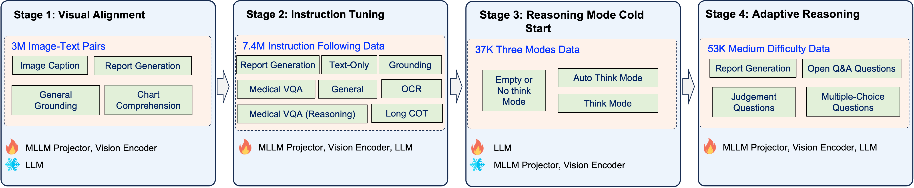

<h1 align='center'>
  JoyMed: A Leading Medical Foundation Model with Adaptive Reasoning
</h1>

<div align='center'>
      
</div>

<div align='center'>
    <a target="_blank" href="" onclick="return false;">Ju&nbsp;Huang</a>&nbsp
    <a target="_blank" href="" onclick="return false;">Xinyi&nbsp;Liu</a>&nbsp
    <a target="_blank" href="" onclick="return false;">Sheng&nbsp;Shi</a>&nbsp
    <a target="_blank" href="" onclick="return false;">Fangru&nbsp;Zhou</a>&nbsp
    <a target="_blank" href="" onclick="return false;">Jun&nbsp;Zhao</a>&nbsp
    <a target="_blank" href="" onclick="return false;">Jun&nbsp;Xu</a>&nbsp
</div>

<br>

<div align='center'>
    JDH Algo, JD Health International Inc.  
</div>

<br>

<div align='center'>
    <a href='https://github.com/jdh-algo/JoyMed'></a>
    <a href='https://huggingface.co/jdh-algo/JoyMed-8B-v1.0'></a>
    <a href='https://huggingface.co/jdh-algo/JoyMed-32B-v1.0'></a>
</div>

<br>

## 🔥 News

- [2026-04-02]: 🎉 We are pleased to announce the release of [🤗 JoyMed-32B-v1.0](https://huggingface.co/jdh-algo/JoyMed-32B-v1.0) ! Welcome to use and explore!
- [2026-03-27]: 📝 We open-source the evaluation script for the related benchmark today, please refer to [evaluation/Readme.md](https://github.com/jdh-algo/JoyMed/blob/main/evaluation/Readme.md)!
- [2026-03-26]: 📚 We release [📂 MedDocBench](https://huggingface.co/datasets/jdh-algo/MedDocBench), a self-collected medical benchmark dataset to facilitate research and evaluation in medical multimodal learning!
- [2026-03-26]: ⚙️ We have released [🤗 JoyMed-8B-v1.0](https://huggingface.co/jdh-algo/JoyMed-8B-v1.0) for research and application! Welcome to use and explore!
- [2026-03-26]: 🎉 We propose JoyMed, a medical foundation model with adaptive reasoning that balances reasoning accuracy and efficiency, achieves SOTA across multiple benchmarks, and advances the translation of medical multimodal large models to clinical applications!


## 📖 Overview

Reasoning capabilities are foundational to medical multimodal large models (MMLMs), as they enable trustworthy diagnosis, interpretable decision-making, and effective management of complex clinical cases. However, mainstream MMLMs either lack explicit reasoning capacities or rely on fixed, end-to-end, undifferentiated mandatory reasoning paradigms. This not only introduces chain-of-thought redundancy and wastes computational resources but also degrades performance in pure perceptual tasks due to unnecessary reasoning overhead. The core bottleneck lies in the inherent trade-off between reasoning accuracy and computational efficiency: thorough reasoning ensures rigor for complex tasks but imposes redundant costs on simple tasks, whereas efficiency-oriented simplified output paradigms lack the sufficient reasoning completeness critical for complex clinical decision-making. 
To address these challenges, we propose JoyMed, a leading medical foundation model with adaptive reasoning. Building upon direct output and reasoning-augmented output paradigms, we introduce an adaptive reasoning mechanism that directly outputs results for trivially simple tasks to optimize efficiency, while generating stepwise reasoning traces for complex tasks to balance accuracy and interpretability. Experimental results demonstrate that JoyMed achieves state-of-the-art performance across multiple benchmarks, which effectively balances the core clinical requirements of comprehensive accuracy and efficient result acquisition, marking an exploratory step toward translating MMLMs from laboratory research to practical clinical applications.




### Key Features

- **Superior Performance**: Our model achieves leading performance across multiple core medical benchmarks,encompassing medical image understanding, text-based question answering, medical document comprehension, and medical report generation, demonstrating its robust capabilities. This outstanding performance stems from our carefully designed two-stage training strategy. First, fine-grained vision-language alignment training significantly enhances the model’s perceptual ability for key regions such as lesions and anatomical structures. Subsequently, reinforcement on complex tasks like report generation and case analysis establishes precise associations between visual regions and textual descriptions, providing solid support for high-level medical visual understanding and question answering.
- **Adaptive Reasoning**: To strike an optimal balance between computational efficiency and deep reasoning, we innovatively propose an adaptive reasoning mechanism. Its core involves constructing a difficulty-tiered dataset and designing corresponding training strategies to mitigate potential mode collapse during the model’s autonomous reasoning process, enabling independent assessment of the intrinsic complexity of problems. Our proposed model operates in three modes: direct output, chain-of-thought reasoning, and adaptive thinking. This design allows the model to intelligently allocate computational resources based on task demands while maintaining high accuracy and interpretability, thereby achieving an optimal trade-off between effectiveness and efficiency.


## 🚀 Model Zoo
JoyMed comes in two variants with different parameter configurations:

|  Model  |  Parameters  |                     Hugging Face                     |
| :------: | :-------: | :--------------------------------------------------: |
| JoyMed-8B-v1.0 | 8B | [🤗 JoyMed-8B-v1.0](https://huggingface.co/jdh-algo/JoyMed-8B-v1.0) |
| JoyMed-32B-v1.0 | 32B | [🤗 JoyMed-32B-v1.0](https://huggingface.co/jdh-algo/JoyMed-32B-v1.0) |


## 🏆 Performance

### Medical Textual Question Answering Benchmarks
The best results on each benchmark and average accuracy are highlighted in **bold**, and the scores with <u>underline</u> indicate the second best. Note that MedXQA and SGPQA denote MedXpertQA-Text and SuperGPQA-medical benchmarks.

| **Model** | **PubMedQA** | **MedMCQA** | **MedXQA** | **CMMLU** | **SGPQA** | **MedQA (USMLE)** | **MedQA (MCMLE)** | **Medbullets (op-4)** | **Medbullets (op-5)** | **Avg.** |
|:---|:---:|:---:|:---:|:---:|:---:|:---:|:---:|:---:|:---:|:---:|
| **Proprietary Models** |  |  |  |  |  |  |  |  |  |  |
| GPT 4.1 | 76.00 | 87.98 | 30.82 | 81.02 | 50.60 | 77.07 | 81.73 | 78.90 | 73.38 | 70.83 |
| GPT 5 | 78.00 | 62.99 | 40.75 | 82.93 | 49.54 | 76.96 | 74.00 | 88.93 | 87.30 | 71.27 |
| Doubao Seed 1.6 | 76.00 | 75.06 | 30.67 | 91.67 | 55.19 | 93.48 | 94.02 | 82.79 | 76.62 | 75.06 |
| **Open-Source Models (<10B)** |  |  |  |  |  |  |  |  |  |  |
| MedGemma 4B | 73.00 | 52.26 | 13.10 | 43.96 | 21.52 | 55.54 | 41.10 | 48.05 | 42.53 | 43.45 |
| Qwen3-VL 8B | 73.20 | 60.05 | 14.98 | 79.07 | 35.68 | 65.67 | 85.61 | 55.84 | 48.70 | 57.64 |
| HuatuoGPT-V 7B | 73.60 | 51.95 | 10.33 | 71.12 | 22.11 | 52.95 | 73.09 | 43.51 | 37.66 | 48.48 |
| Lingshu 7B | 75.40 | 56.13 | 16.45 | 69.02 | 27.51 | 63.39 | 75.98 | 62.66 | 52.92 | 55.50 |
| Citrus-V 8B | 74.80 | 55.10 | 16.90 | 71.19 | 29.47 | 64.89 | 76.94 | 59.09 | 54.22 | 55.84 |
| Hulu-Med 7B | 77.20 | **67.51** | 18.53 | 71.72 | 31.10 | 73.45 | 78.93 | 64.94 | 57.47 | 60.09 |
| JoyMed 8B | 78.20 | 65.36 | <u>23.67</u> | 82.75 | 37.10 | 82.64 | 92.06 | 73.05 | 68.18 | 67.00 |
| JoyMed 8B auto | **79.40** | 66.58 | 23.55 | <u>83.05</u> | <u>38.04</u> | <u>84.84</u> | 91.42 | **74.35** | **70.46** | <u>67.96</u> |
| JoyMed 8B thinking | <u>79.00</u> | <u>66.89</u> | **24.37** | **83.35** | **39.78** | **85.23** | <u>91.77</u> | <u>73.38</u> | <u>70.13</u> | **68.21** |
| **Open-Source Models (>10B)** |  |  |  |  |  |  |  |  |  |  |
| MedGemma 27B | 79.00 | 63.23 | 22.01 | 60.24 | 33.18 | 81.15 | 64.89 | 67.86 | 65.58 | 59.68 |
| Qwen3-VL 32B | 72.00 | 69.57 | 18.65 | 86.87 | 46.24 | 77.77 | 89.73 | 63.96 | 53.90 | 64.30 |
| HealthGPT 14B | 69.40 | 63.33 | 12.45 | 55.36 | 25.59 | 66.93 | 52.83 | 53.57 | 50.00 | 49.94 |
| HealthGPT 32B | 74.20 | 64.04 | 13.84 | 69.47 | 35.43 | 68.89 | 68.86 | 50.65 | 46.43 | 54.65 |
| HuatuoGPT-V 34B | 71.00 | 55.08 | 12.20 | 77.64 | 28.06 | 58.52 | 76.09 | 44.81 | 39.29 | 51.41 |
| Lingshu 32B | 78.20 | 65.05 | 22.86 | 82.37 | 40.80 | 74.94 | 86.98 | 68.51 | 63.31 | 64.78 |
| Citrus-V 33B | 78.40 | 65.62 | 22.20 | 83.27 | 41.63 | 80.28 | 87.65 | 67.53 | 66.23 | 65.87 |
| Hulu-Med 14B | 79.80 | 70.28 | 23.67 | 75.62 | 37.75 | 78.48 | 80.88 | 70.45 | 67.86 | 64.98 |
| Hulu-Med 32B | **80.20** | 72.56 | 23.92 | 76.07 | 41.71 | 80.13 | 84.30 | 71.75 | 68.18 | 66.54 |
| JoyMed 32B | **80.20** | 72.72 | **32.65** | 88.22 | <u>48.93</u> | 87.43 | <u>93.90</u> | 80.52 | 76.30 | 73.43 |
| JoyMed 32B auto | <u>80.00</u> | <u>72.96</u> | <u>31.35</u> | <u>88.30</u> | <u>48.93</u> | **90.34** | **94.31** | **81.82** | **78.57** | **74.06** |
| JoyMed 32B thinking | 78.60 | **73.39** | 31.31 | **89.27** | **51.25** | <u>89.16</u> | **94.31** | <u>80.84</u> | <u>76.62</u> | <u>73.86</u> |

### Medical Visual Question Answering Benchmarks
The best results on each benchmark and average accuracy are highlighted in **bold**, and the scores with <u>underline</u> indicate the second best. Note that MedXQA and GMAI-MMB denote MedXpertQA-mm and GMAI-MMBench-test benchmarks.

| **Model** | **VQA-RAD** | **MedXQA** | **SLAKE** | **PATH-VQA** | **PMC-VQA** | **OmniMedVQA** | **GMAI-MMB** | **Avg.** |
|:---|:---:|:---:|:---:|:---:|:---:|:---:|:---:|:---:|
| **Proprietary Models** |  |  |  |  |  |  |  |  |
| GPT 4.1 | 62.53 | 43.35 | 72.54 | 54.97 | 38.76 | 55.14 | 58.52 | 55.12 |
| GPT 5 | 68.37 | 51.48 | 65.82 | 31.74 | 36.10 | 38.44 | 56.18 | 49.73 |
| Doubao Seed 1.6 | 33.49 | 45.75 | 67.28 | 47.58 | 49.94 | 61.68 | 48.50 | 50.60 |
| **Open-Source Models (<10B)** |  |  |  |  |  |  |  |  |
| MedGemma 4B | 72.06 | 22.05 | 78.32 | 48.64 | 48.02 | 70.04 | 45.59 | 54.96 |
| Qwen3-VL 7B | 63.41 | 25.00 | 72.11 | 43.65 | 54.01 | 76.90 | 54.31 | 55.63 |
| HuatuoGPT-V 7B | 67.85 | 22.30 | 69.39 | 44.29 | 53.84 | 75.14 | 51.56 | 54.91 |
| Lingshu 7B | 68.74 | 26.90 | 82.90 | 60.23 | 55.77 | 82.41 | 54.02 | 61.57 |
| Citrus-V 8B | 64.30 | 25.10 | 84.91 | 62.00 | 55.64 | 72.69 | 45.43 | 57.45 |
| Hulu-Med 7B | 74.50 | 27.70 | 82.66 | 62.57 | **66.95** | **83.70** | 54.28 | 64.62 |
| JoyMed 8B | 75.83 | 32.60 | 86.53 | 74.16 | 57.19 | <u>82.36</u> | 59.85 | 66.93 |
| JoyMed 8B auto | <u>76.50</u> | **33.25** | **87.97** | <u>75.06</u> | 58.34 | 81.47 | **60.37** | <u>67.56</u> |
| JoyMed 8B thinking | **79.16** | <u>33.20</u> | <u>86.82</u> | **75.34** | <u>58.52</u> | 81.43 | <u>60.35</u> | **67.83** |
| **Open-Source Models (>10B)** |  |  |  |  |  |  |  |  |
| MedGemma 27B | 63.86 | 33.10 | 76.17 | 47.60 | 45.35 | 59.78 | 40.59 | 52.35 |
| Qwen3-VL 32B | 68.96 | 30.15 | 77.41 | 49.78 | 57.28 | 77.90 | 55.86 | 59.62 |
| Lingshu 32B | 75.39 | 31.00 | 87.68 | 64.76 | 57.23 | 82.95 | 55.32 | 63.21 |
| HealthGPT 14B | 64.08 | 24.55 | 67.43 | 58.67 | 56.90 | 76.45 | 45.67 | 56.25 |
| HealthGPT 32B | 64.75 | 26.40 | 70.58 | 62.93 | 54.93 | 73.09 | 46.61 | 57.04 |
| HuatuoGPT-V 34B | 63.64 | 22.65 | 73.02 | 44.92 | 56.79 | 73.93 | 54.29 | 55.61 |
| Citrus-V 33B | 77.83 | 29.15 | 88.40 | 63.89 | 59.74 | 77.02 | 53.50 | 64.22 |
| Hulu-Med 14B | 74.70 | 29.65 | 84.24 | 64.55 | <u>68.80</u> | **85.22** | 57.42 | 66.37 |
| Hulu-Med 32B | 79.60 | 33.40 | 85.86 | 66.44 | **69.52** | 84.41 | 59.60 | 68.40 |
| JoyMed 33B | 88.69 | <u>41.25</u> | 92.93 | <u>91.29</u> | 61.46 | <u>84.75</u> | <u>61.02</u> | <u>74.48</u> |
| JoyMed 33B auto | **89.14** | **42.45** | **94.70** | **92.19** | 61.17 | 84.22 | **61.21** | **75.01** |
| JoyMed 33B thinking | <u>87.81</u> | 41.00 | <u>93.27</u> | 89.49 | 61.32 | 81.31 | 60.62 | 73.54 |

### Medical Document Understanding Benchmarks
The best results on each benchmark and average accuracy are highlighted in **bold**, and the scores with <u>underline</u> indicate the second best.

|  | **Laboratory Test Report** |  |  | **GMD** |  |  |
|:---|:---:|:---:|:---:|:---:|:---:|:---:|
| **Model** | **abnormalityQA** | **fullparsing** | **simpleQA** | **Simple QA** | **Complex QA** | **Avg.** |
| **Proprietary Models** |  |  |  |  |  |  |
| GPT 4.1 | 45.39 | 73.97 | 66.00 | 45.60 | 55.85 | 57.36 |
| GPT 5 | 71.87 | 71.41 | 78.75 | 59.35 | 57.04 | 67.68 |
| Doubao Seed 1.6 | 82.16 | 81.09 | 85.00 | 73.60 | 79.25 | 80.22 |
| **Open-Source Models (<10B)** |  |  |  |  |  |  |
| MedGemma 4B | 13.31 | 36.39 | 17.75 | 18.10 | 20.05 | 21.12 |
| Qwen3-VL 8B | 48.17 | 79.71 | 84.50 | 78.72 | 79.05 | 74.03 |
| HuatuoGPT-V 7B | 7.54 | 32.14 | 9.50 | 17.40 | 9.60 | 15.24 |
| Lingshu 7B | 29.50 | 62.70 | 70.25 | 60.47 | 53.70 | 55.32 |
| Citrus-V 8B | **91.16** | <u>92.57</u> | <u>92.57</u> | 83.22 | **89.45** | **90.18** |
| Hulu-Med 7B | 11.35 | 43.07 | 19.75 | 19.30 | 15.72 | 21.84 |
| JoyMed 8B | 88.99 | **93.39** | 92.00 | 83.47 | <u>86.72</u> | <u>88.91</u> |
| JoyMed 8B auto | <u>90.80</u> | 88.87 | **94.00** | **85.20** | 85.67 | <u>88.91</u> |
| JoyMed 8B thinking | <u>90.80</u> | 88.87 | **94.00** | <u>85.10</u> | 85.47 | 88.85 |
| **Open-Source Models (>10B)** |  |  |  |  |  |  |
| MedGemma 27B | 10.89 | 35.15 | 28.25 | 19.50 | 14.55 | 21.67 |
| Qwen3-VL 32B | 50.86 | 83.85 | <u>94.50</u> | 81.00 | 84.90 | 79.02 |
| Lingshu 32B | 35.34 | 71.19 | 74.00 | 62.00 | 58.38 | 60.18 |
| HealthGPT 14B | 5.40 | 39.37 | 13.00 | 20.00 | 9.20 | 19.26 |
| HealthGPT 32B | 6.12 | 33.91 | 21.75 | 21.10 | 9.97 | 20.59 |
| HuatuoGPT-V 34B | 7.81 | 32.78 | 10.75 | 19.00 | 8.00 | 17.11 |
| Citrus-V 33B | 92.45 | 92.62 | **97.75** | 84.30 | 83.78 | 90.18 |
| Hulu-Med 14B | 7.59 | 45.02 | 26.75 | 22.40 | 15.40 | 26.45 |
| Hulu-Med 32B | 11.45 | 41.32 | 31.50 | 30.30 | 18.90 | 28.09 |
| JoyMed 32B | 90.12 | 93.68 | 91.50 | 84.30 | **85.96** | 91.77 |
| JoyMed 32B auto | **94.65** | **94.67** | 94.00 | **87.50** | <u>85.85</u> | <u>94.44</u> |
| JoyMed 32B thinking | <u>94.58</u> | <u>94.46</u> | <u>94.50</u> | <u>87.40</u> | 81.40 | **94.51** |

### Medical Image Report Generation Benchmarks
The best results on each benchmark and average accuracy are highlighted in **bold**, and the scores with <u>underline</u> indicate the second best.

|  | **CheXpert Plus** |  | **IU XRAY** |  |
|:---|:---:|:---:|:---:|:---:|
| **Model** | **ROUGE-L** | **RaTE** | **ROUGE-L** | **RaTE** |
| **Proprietary Models** |  |  |  |  |
| GPT 4.1 | 24.50 | 45.50 | 32.63 | 50.91 |
| GPT 5 | 24.48 | 51.26 | 31.72 | 56.64 |
| Doubao Seed 1.6 | 19.27 | 45.49 | 22.67 | 53.76 |
| **Open-Source Models (<10B)** |  |  |  |  |
| MedGemma 4B | 26.01 | 51.23 | 39.51 | 61.99 |
| Qwen3-VL 7B | 21.64 | 46.51 | 25.22 | 52.88 |
| HuatuoGPT-V 7B | 21.40 | 46.58 | 29.96 | 54.91 |
| Lingshu 7B | 26.50 | 45.40 | <u>44.52</u> | 60.30 |
| Citrus-V 8B | 28.94 | 51.07 | 24.78 | 56.25 |
| Hulu-Med 7B | 28.94 | 51.07 | 36.15 | 63.50 |
| JoyMed 8B | **32.54** | 55.68 | 42.85 | 64.90 |
| JoyMed 8B auto | 31.68 | <u>55.73</u> | **44.94** | **65.96** |
| JoyMed 8B thinking | <u>31.99</u> | **55.89** | 44.40 | <u>65.70</u> |
| **Open-Source Models (>10B)** |  |  |  |  |
| MedGemma 27B | 17.65 | 48.73 | 32.59 | 58.70 |
| Qwen3-VL 32B | 19.28 | 47.60 | 25.96 | 59.12 |
| Lingshu 32B | 25.29 | 46.18 | <u>45.06</u> | 65.22 |
| HealthGPT 14B | 21.29 | 47.82 | 23.89 | 52.33 |
| HealthGPT 32B | 12.50 | 45.15 | 12.74 | 45.75 |
| HuatuoGPT-V 34B | 23.97 | 45.51 | 29.12 | 57.87 |
| Citrus-V 33B | 29.58 | 52.45 | 45.66 | 64.74 |
| Hulu-Med 14B | 23.08 | 50.25 | 36.15 | 63.50 |
| Hulu-Med 32B | 29.20 | 52.87 | **47.02** | <u>65.43</u> |
| JoyMed 32B | **30.79** | **54.33** | 42.19 | 63.85 |
| JoyMed 32B auto | 28.59 | <u>54.28</u> | 40.63 | 63.14 |
| JoyMed 32B thinking | <u>30.04</u> | 53.60 | 44.05 | **66.19** |


## 🛠️ Installation

1. Installing vLLM
    ```shell
    uv venv
    source .venv/bin/activate
    uv pip install -U vllm --torch-backend=auto

    # Update transformers to support the latest models.
    pip install -U "transformers==5.2.*"
    ```

2. Running JoyMed-8B-v1.0
    ```bash
    vllm serve jdh-algo/JoyMed-8B-v1.0 \
        --tensor-parallel-size 8 \
        --mm-encoder-tp-mode data \
        --mm-processor-cache-type shm \
        --enable-prefix-caching \
        --trust-remote-code \
        --gpu-memory-utilization 0.9
    ```

## 💻 Quick Start

### **Instruct** mode

```python
from openai import OpenAI

client = OpenAI(
    base_url="http://localhost:8000/v1",
    api_key="EMPTY"
)

response = client.chat.completions.create(
    model="jdh-algo/JoyMed-8B-v1.0",
    messages=[{"role": "user", "content": "What are the common causes of hypertension in adults? /no_think"}] # end with '/no_think' or nothing
)

print(response.choices[0].message.content)
```

### **Thinking** mode

```python
from openai import OpenAI

client = OpenAI(
    base_url="http://localhost:8000/v1",
    api_key="EMPTY"
)

response = client.chat.completions.create(
    model="jdh-algo/JoyMed-8B-v1.0",
    messages=[{"role": "user", "content": "What are the common causes of hypertension in adults? /think"}]
)

print(response.choices[0].message.content)
```

### **Auto** mode

```python
from openai import OpenAI

client = OpenAI(
    base_url="http://localhost:8000/v1",
    api_key="EMPTY"
)

response = client.chat.completions.create(
    model="jdh-algo/JoyMed-8B-v1.0",
    messages=[{"role": "user", "content": "What are the common causes of hypertension in adults? /auto_think"}]
)

print(response.choices[0].message.content)
```

## 🏛 License
This project is licensed under the Apache License (Version 2.0). For models and datasets, please refer to the original resource page and follow the corresponding License.